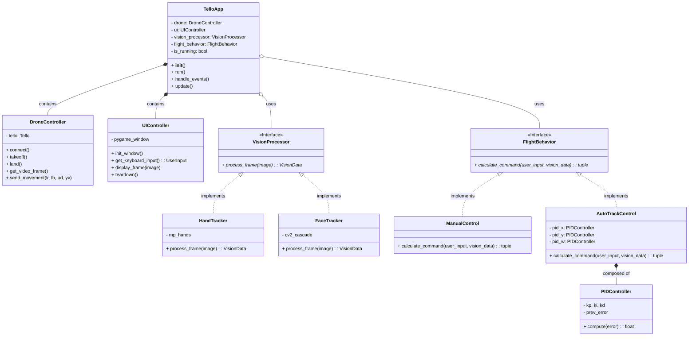

# 架構設計理念 (暫時)

### 備忘錄
自動導航可嘗試\
-> 光流 (https://ieeexplore.ieee.org/document/10964683)

以下缺乏設備，暫時不考慮\
-> EGO-Planner\
-> GAAS (Generic Autonomous Aviation System)\
-> Vision-Based Drone Obstacle Avoidance by DRL


## 1. 硬體抽象層 DroneController
職責： 專門負責與無人機通訊（封裝 djitellopy）。

未來如果換了一台無人機（例如 DJI 大疆的其他型號，或自組的飛控），只需要修改或抽換這個 Class，主程式和其他邏輯完全不用動。

## 2. 輸入與介面層 UIController
職責： 處理 Pygame 鍵盤監聽、OpenCV 畫面顯示與視窗刷新。

如果未來想把鍵盤控制改成「搖桿控制 (Joystick)」，或者把視窗改成一個完整的 GUI，只需修改此模組。

## 3. 視覺處理策略 VisionProcessor (Interface)
職責： 接收一張圖片，回傳分析結果（例如目標的 (x, y) 座標與大小）。

我們定義一個標準的介面，未來要新增功能（例如：FaceTracker 人臉辨識、ArucoMarkerTracker 條碼定位），只要新增一個繼承 VisionProcessor 的 Class 即可，主迴圈完全不需要修改。

## 4. 飛行邏輯策略 FlightBehavior (Interface)
職責： 根據「使用者的輸入」與「視覺辨識的結果」，計算出無人機下一步該怎麼飛 (lr, fb, ud, yv)。

擴充性： 將手動遙控 (ManualControl) 與 自動跟追 (AutoTrackControl) 拆開。AutoTrackControl 內部再調用獨立的 PIDController。未來可以輕鬆加入 PatrolControl (路徑巡航) 或 SearchControl (原地旋轉搜尋目標)。

## class diagram


## 檔案規劃 (暫時)
```
prototype/
│
├── main.py                # 程式唯一的進入點 (負責啟動 TelloApp)
│
├── core/                  # 核心硬體與介面模組
│   ├── __init__.py
│   ├── tello_app.py       # 應用程式主迴圈 (TelloApp)
│   ├── drone_controller.py# 封裝 djitellopy (DroneController)
│   └── ui_controller.py   # 封裝 Pygame 與鍵盤輸入 (UIController)
│
├── vision/                # 視覺辨識模組
│   ├── __init__.py
│   ├── base.py            # 定義 VisionProcessor 介面
│   └── hand_tracker.py    # 將原本的 HandDetector 類別放進來
│
├── behaviors/             # 飛行策略模組
│   ├── __init__.py
│   ├── base.py            # 定義 FlightBehavior 介面
│   ├── manual_control.py  # 手動控制邏輯
│   └── auto_track.py      # 自動跟追邏輯
│
└── utils/                 # 輔助工具
    ├── __init__.py
    └── pid_controller.py  # 將 PID 演算法獨立出來
```

## 操作設定
Q 鍵：退出程式\
T 鍵：起飛\
L 鍵：降落

W 鍵：上升\
S 鍵：下降\
A 鍵：機頭向左旋轉 (逆時針)\
D 鍵：機頭向右旋轉 (順時針)

左鍵：向左飛\
右鍵：向右飛\
上鍵：向前飛\
下鍵：向後飛

z: 切換飛行模式

手部鎖定操作
L: 鍵切換鎖定開關
R: 鍵重新鎖定新目標

***voice command map***

```
"tello please take off": "起飛",
"泰羅請起飛": "起飛",

"tello please land": "降落",
"泰羅請降落": "降落",

"tello go forward": "前進",
"泰羅向前飛": "前進",

"tello go backward": "後退",
"泰羅向後退": "後退",

"tello go left": "向左",
"泰羅向左飛": "向左",

"tello go right": "向右",
"泰羅向右飛": "向右",

"tello go up": "上升",
"泰羅向上升": "上升",

"tello go down": "下降",
"泰羅向下降": "下降",

"tello turn around": "轉向",
"泰羅請轉向": "轉向"
```